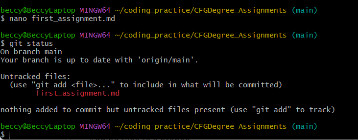
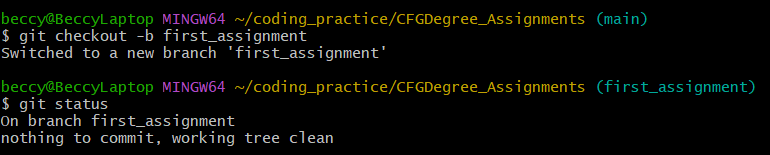

# Beccy McHugh
Hi, I'm Beccy. 
I have been a teacher for **11 years** and now I want to learn coding. 
My first degree was *Sociology and Statistics* so I've always been interested in data analysis.
I have been teaching maths in secondary schools across the UK and have now settled in Wales. 
I have worked at
+ St Annes in Stockport
+ Caldicot Comprehensive
+ Chepstow Comprehensive
  
I have lived all over the world:
1. UK
2. India
3. South Africa
This has helped me travel to some exciting and exotic places. 
I'm really looking forward to becoming a programmer :smiling_face_with_three_hearts:

Thanks for reading about me
> Beccy

## Git Status

 
## New Branch

